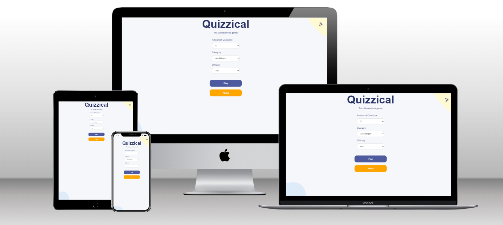

# Quizzical-Trivia-App

> Quizz Trivia

It's a quiz app. When you finish the quiz, you get a score and you see which questions you answered correctly, and if you answered incorrectly the correct answer is displayed. Also the "check answers" button switches to the "play again" button, so you can start a new quiz.
 
This project was bootstrapped with [Create React App](https://github.com/facebook/create-react-app).

Additional description about the project and its features.

## Built With

- Major languages
  - Javascript
  - Css

- Frameworks
  - React Hook
  - React Components
  - React Router

- Technologies used
  - github
  - npm

## [LiveDemo] 
(https://melodic-biscotti-076739.netlify.app/)

## Getting Started

**This are steps on how to install the react app.**

To get a local copy up and running follow these simple example steps.

### `clone repository on your local device`

copy this link to get HTTP url to clone Into your device `https://github.com/Fatima-hub333/quizzical-trivia.git`

### Prerequisites

### `npm start`

Runs the app in the development mode.\
Open [http://localhost:3000](http://localhost:3000) to view it in the browser.

The page will reload if you make edits.\
You will also see any lint errors in the console.

### `npm test`

Launches the test runner in the interactive watch mode.\
See the section about [running tests](https://facebook.github.io/create-react-app/docs/running-tests) for more information.

### `npm run build`

Builds the app for production to the `build` folder.\
It correctly bundles React in production mode and optimizes the build for the best performance.

The build is minified and the filenames include the hashes.\
Your app is ready to be deployed!

See the section about [deployment](https://facebook.github.io/create-react-app/docs/deployment) for more information.

### `npm run eject`

**Note: this is a one-way operation. Once you `eject`, you can’t go back!**

## Authors

👤 **Fatima Zahir**

- GitHub: [@githubhandle](https://github.com/Fatima-hub333)
- Twitter: [@twitterhandle](https://twitter.com/Fatima_developr)
- LinkedIn: [LinkedIn](https://www.linkedin.com/in/fatimaa-zahir/)

## 🤝 Contributing

Contributions, issues, and feature requests are welcome!

Feel free to check the [issues page](https://github.com/Fatima-hub333/quizzical-trivia/issues).

## Show your support

Give a ⭐️ if you like this project!

## 📝 License

This project is [MIT](./MIT.md) licensed.